# Flood Monitor & Water Depth Pipeline

One pipeline from raw inputs to water-depth maps: **FABDEM DEM** (Google Earth
Engine) + **GFM flood extent** (EODC STAC) + **FLEXTH water depth/level**
([FLEXTH fork](https://github.com/kwundram2602/FLEXTH), based on
[hyunholee26/FLEXTH](https://github.com/hyunholee26/FLEXTH)).
The app is driven by a
single `config.yaml` and a Streamlit dashboard.

The app turns a satellite-derived flood extent into an interpolated water depth
map and a set of impact numbers for any area of interest — potentially useful
for natural hazard response as well as for research. It makes the limitations of
GFM visible, especially in urban areas where the radar-based detection cannot
evaluate large parts of a city, and it lets you compare the different GFM
algorithms (DLR, TUW, the ensemble) against each other for the same scene. On
top of that it estimates the exposure and damage of the modelled flood:
population, roads and railways, buildings and a rough EUR damage figure. It was
built for an Advanced Cloud Computing course to explore what different cloud
workflows (Google Earth Engine, STAC/EODC,pangeo) can do for such a pipeline.

## Quick start

```bash
uv sync

uv run flood-pipeline dashboard
```

## Steps

The runner executes six steps in order, each configurable and skippable:

- **dem** – downloads the FABDEM terrain model for the AOI from Google Earth Engine.
- **gfm** – loads GFM flood extents from the EODC STAC catalog and aggregates them over the chosen time range.
- **osm** – fetches roads and railways via OSMnx and intersects them with the flood extent to get flooded kilometres.
- **flexth** – resamples DEM and flood mask onto a common grid and runs FLEXTH to estimate water level and depth.
- **population** – combines WorldPop with the depth raster to count affected people.
- **ghsl** – combines GHSL built-up data with the depth raster to estimate building damage.

Each project lives in `projects/<name>/` with its own `config.yaml` and AOI, and
all results are written to that project's output folder.

## Dashboard

The Streamlit app walks through one project from configuration to results.

### Home

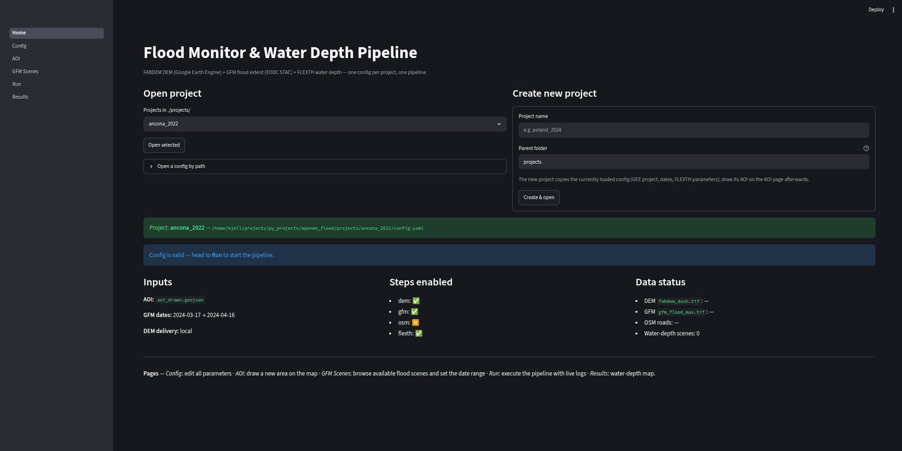

The entry point lists all projects in `./projects/`, opens one of them (or a
config by path) and creates new projects by copying the currently loaded config.
Once a project is open, it summarises the inputs (AOI, GFM date range, DEM
delivery), which steps are enabled and which output files already exist on disk.

### Config

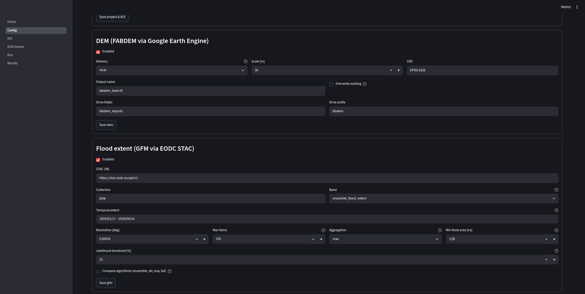

Every parameter of `config.yaml` is editable here, grouped per step — DEM scale,
CRS and export target, GFM collection, band, temporal extent, aggregation and
likelihood threshold, and so on. Each block is saved on its own, so you can
adjust a single step without touching the rest of the config.

### AOI

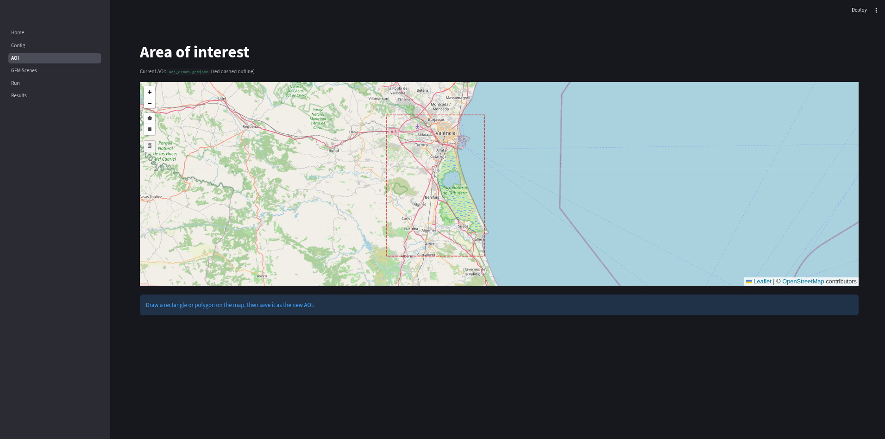

The current area of interest is drawn as a red dashed outline on an
OpenStreetMap background. Drawing a new rectangle or polygon and saving it
writes a new `aoi_drawn.geojson` for the project, which every following step
uses as its spatial extent.

### GFM scenes

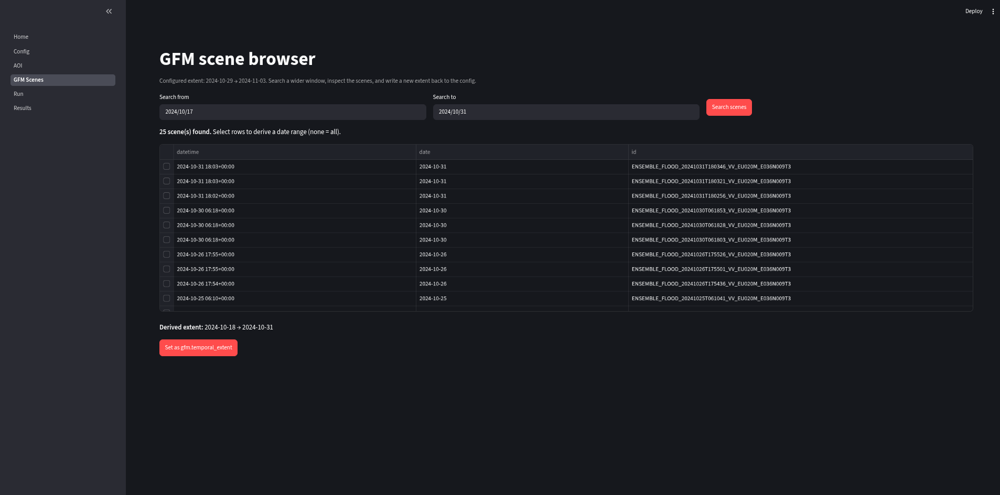

Before running the pipeline you can search the EODC STAC catalog over a wider
time window to see which GFM flood scenes actually exist for the AOI. Selecting
rows derives a date range from them, which can be written straight back into
`gfm.temporal_extent`.

### Run

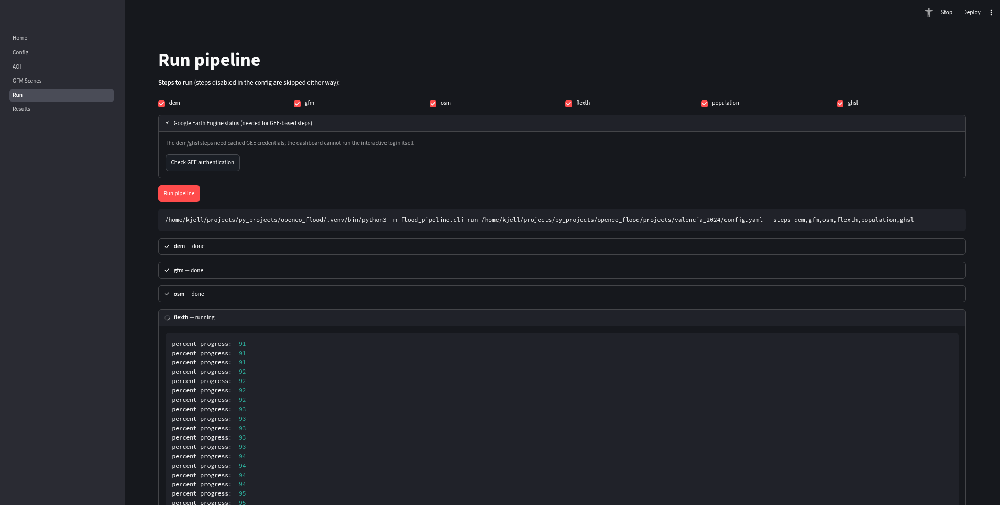

Here you pick which of the six steps to execute, check the cached Google Earth
Engine credentials needed by the GEE-based steps, and start the run. The exact
CLI command is shown, and each step streams its live log into a collapsible
panel — including the FLEXTH progress output.

### Results

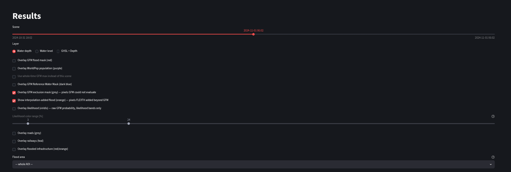

At the top of the page a slider steps through the GFM scenes of the run, and a
layer switch chooses between water depth, water level and GHSL + depth. Below
it every overlay can be toggled individually — flood mask, WorldPop population,
reference water, exclusion mask, interpolation-added flood, likelihood (with its
own colour range), roads, railways and flooded infrastructure.

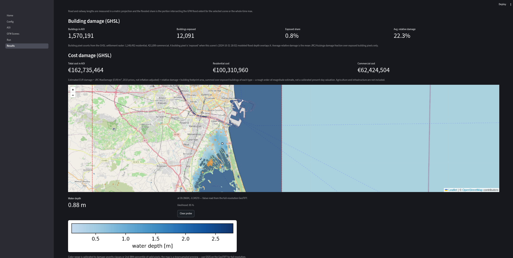

The result map shows the FLEXTH water depth (light blue) (with permanent reference water
added - dark blue) on top of OpenStreetMap, with a colour bar calibrated to the damage
severity classes. Clicking anywhere on the map probes the full-resolution
GeoTIFF and reports the depth and the GFM likelihood at that pixel. Flood pixels that were added by the FLEXTH interpolation are shown in orange.

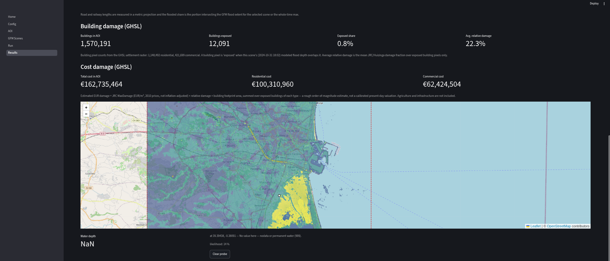

The same map can be switched to the GFM ensemble likelihood layer, which shows
how confident the flood detection is per pixel. Probing a pixel outside the
modelled depth returns `NaN` — nodata or permanent water — together with its
likelihood value.

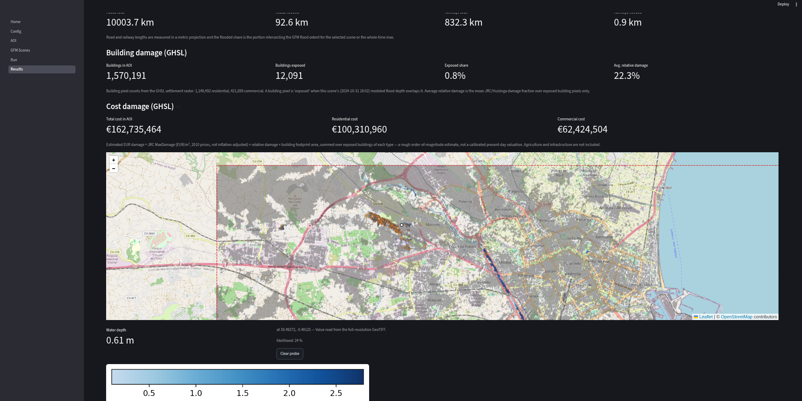

A third overlay shows the GFM exclusion mask in grey: pixels the flood detection
could not evaluate for this scene — mostly dense urban areas, radar shadow and
layover. It is always the selected scene's own mask, and it explains where an
the GFM could not make a meaningful observation. The same mask is optionally
handed to FLEXTH so it can fill those gaps.

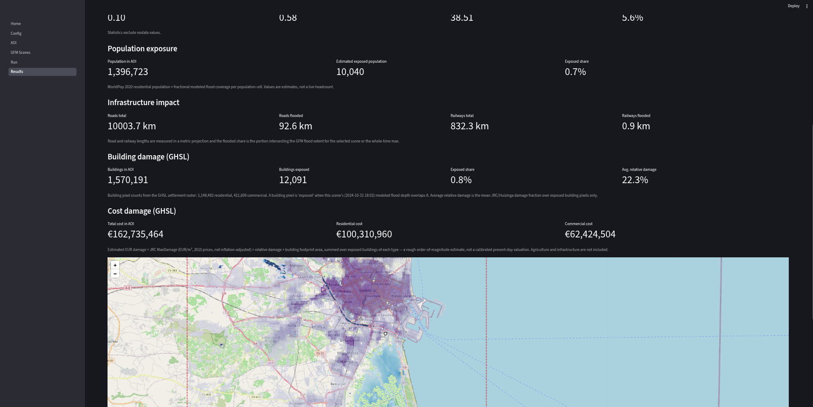

Above the map, the page aggregates the impact indicators: population exposure
from WorldPop, flooded road and railway kilometres from OSM, exposed buildings
from GHSL, and a rough EUR damage estimate based on JRC/Huizinga depth-damage
curves. Each block states its own caveats — these are order-of-magnitude
estimates, not calibrated figures.

## Data flow

Where each step gets its data from and what it writes to `outputs/`:

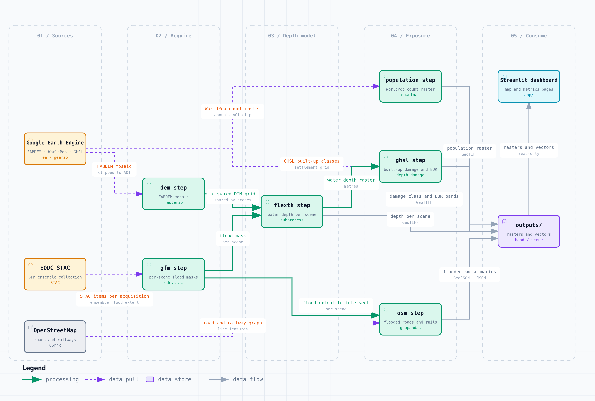
